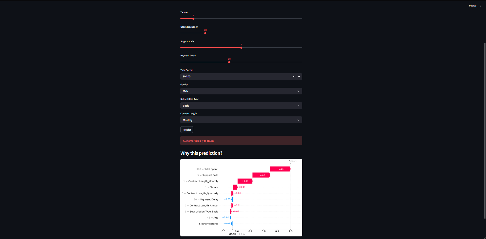

# Customer Churn Prediction Dashboard

An end-to-end Machine Learning project that predicts customer churn and explains predictions using SHAP (Explainable AI).

---

## Live Demo
[(Add your deployed link here after deployment)](https://ai-churn-dashboard-y927gexmccpwtu7c4ghruy.streamlit.app)

---

## Problem Statement
Customer churn is a major challenge for subscription-based businesses. Identifying customers likely to churn helps companies take proactive measures to retain them.  

This project builds a machine learning system to predict churn and provides interpretability using SHAP.

---

## Tech Stack
- Python
- Pandas, NumPy
- Scikit-learn (Random Forest)
- Streamlit (Web App)
- SHAP (Explainable AI)
- Matplotlib

---

## Project Structure
ai-churn-dashboard/
│
├── app.py # Streamlit dashboard
├── train.py # Model training script
├── requirements.txt
├── README.md
│
├── model/
│ ├── model.pkl
│ └── columns.pkl
│
├── data/
│ └── dataset.csv
│
├── screenshot.png


---

## Features
- Real-time customer churn prediction
- Interactive dashboard with user inputs
- SHAP-based explainability for model decisions
- Clean and intuitive UI

---

## Application Preview



---

## Example Output
- Prediction: Customer is likely to churn  
- SHAP visualization explains:
  - Contract type influences churn risk
  - Tenure impacts customer retention
  - Payment delays increase churn probability

---

## How to Run Locally

```bash
# Clone repository
git clone https://github.com/YOUR_USERNAME/ai-churn-dashboard.git

# Navigate to project
cd ai-churn-dashboard

# Install dependencies
pip install -r requirements.txt

# Run app
python -m streamlit run app.py